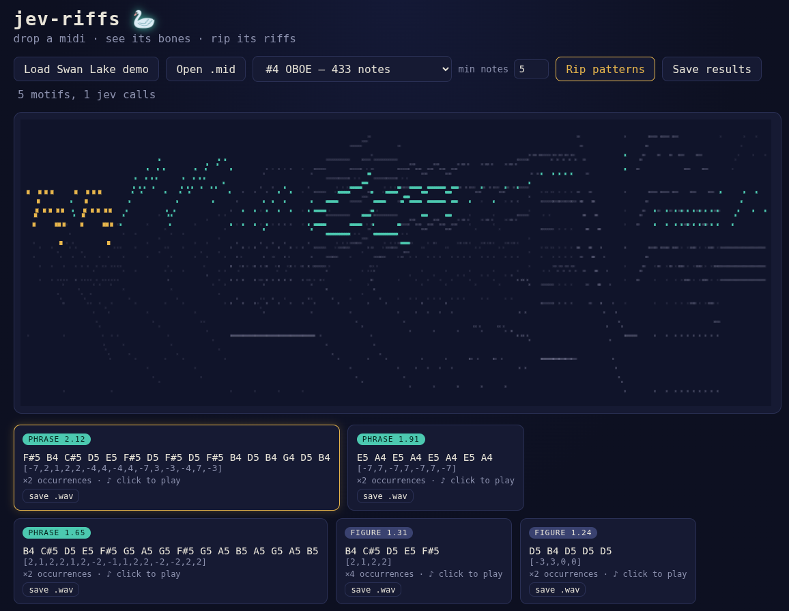

# jev-riffs

[](https://youtu.be/65WxogEZAMM)

🎬 **[Watch the demo](https://youtu.be/65WxogEZAMM)** — load Swan Lake, rip it, click a motif, hear the theme.

A music pattern ripper. Tokenize a MIDI file into an interval string, mine it
for repeating units in code, and have [Jev](https://typesafe.ai) — TypeSafe's
System One model, which answers typed questions instead of generating text —
grade each candidate's *musical significance*. A web UI draws the piano roll,
highlights where each motif lives, plays the full passage on click, and
exports WAV/JSON.

Proven on Tchaikovsky: the ripper pulls the Swan Lake theme out of a 17-track
orchestral MIDI as its top-ranked motif, in one batched API call, in ~600ms.

The Jev client library used throughout is documented in
[LIBRARY.md](LIBRARY.md).

## Pipeline

```
.mid bytes
  → parseMidi()      tracks of note-on events        (src/midi.ts)
  → melodyOf()       one track, monophonized
  → toIntervals()    semitone deltas — the token string
  → findCandidates() repeating units, mined in code  (src/patterns.ts)
  → rip()            one batched Jev request grades  (src/rip.ts)
                     every candidate's significance
```

### Tokenization (src/midi.ts)

- `parseMidi(bytes)` — minimal SMF reader: header + `MTrk` chunks, VLQ
  deltas, running status, meta/sysex skipping. Extracts only note-ons
  (`0x9n`, velocity > 0) as `{tick, note, channel}` plus the track-name meta
  (`FF 03`). Durations and controllers are deliberately ignored; the ripper
  needs pitch order, not performance data.
- `melodyOf(tracks, pick?)` — melody heuristic: densest track after dropping
  channel-10 (drums), or an explicit track index. Chords collapse to their
  top note per tick (melody rides the soprano line).
- `toIntervals(notes)` — consecutive semitone deltas. Two properties matter:
  the alphabet is small (mostly ±12), and the encoding is
  **transposition-invariant** — a riff restated up a fourth produces the
  identical token substring, so the miner sees through key changes for free.
- `parseTiming(bytes)` — ticks-per-quarter from the header (SMPTE division
  falls back to 480) and the first `FF 51` tempo meta (default 500000 µs =
  120 bpm). `secondsPerTick = tempoUs / 1e6 / division`; playback uses the
  piece's real tempo (Swan Lake: division 384, 750000 µs → 80 bpm).

### Candidate mining (src/patterns.ts)

`findCandidates(seq, top = 20, minLen = 2)` is pure code — counting repeats
is mechanical, and unlike a judgment loop it cannot be led astray by noise:

1. Enumerate every window of length `minLen..⌊n/2⌋`; count **non-overlapping
   full occurrences** (greedy scan); keep `count ≥ 2`.
2. Prune, in order:
   - **shadows** — a sub-block that never out-occurs a longer candidate
     containing it (`[7,3]` inside `[7,3,8,2,4]`, both ×3);
   - **periodic units** — `[1,2,1,2]` is `[1,2]` twice, never a unit itself;
   - after ranking by coverage (`count × length`), **rotation echoes**
     (`[2,1]` is `[1,2]` caught mid-cycle) and **superstrings** that don't
     out-cover a kept candidate they contain (unit + trailing noise).
3. Rank by coverage, cap at `top`.

`extractPatterns()` (binary noul judgment per candidate) is retained for
non-musical sequences; music wants the graded version below.

### Significance grading (src/rip.ts)

`rip(intervals, budget = 100, fetchImpl = fetch, verbose = false,
chunkSize = 10, minNotes = 1)` → `{ motifs, tries, budgetExhausted } | Error`

The obvious question — "is this a genuine motif?" — **saturates on music**:
in the first live run Jev said yes to all 20 candidates, and it was right
every time, because everything the miner surfaces does repeat deliberately.
So the judgment is a **score** over four ordered levels:

```
0 incidental overlap … 1 recurring figure … 2 recurring phrase … 3 signature theme
```

Each motif gets `significance` (the probability-weighted position, e.g.
2.09) and `label` (the winning level). Sort is significance-major,
coverage-minor.

Two operational lessons are baked in:

- **Batching.** All candidate judgments are independent questions over the
  same state, so they ride in ONE request (chunked at `chunkSize`), exactly
  as the System One docs prescribe. This matters: 15 sequential round trips
  degraded to 2+ minutes when API latency wobbled; the batch runs in ~600ms
  and uploads `intervals` once instead of 15 times.
- **minNotes** (UI default 5) becomes the miner's `minLen` floor
  (`minNotes − 1` intervals), so short trivia is never judged at all. On the
  Swan Lake oboe: 15 motifs / 2 calls → 5 motifs / 1 call, and the miner
  surfaces fuller units (the two-note E–A pair becomes its complete 8-note
  alternation).

`budget` caps API requests; exceeding it returns partial results with
`budgetExhausted: true`. Transport errors come back as `Error` values, never
throws (see LIBRARY.md).

## Not all MIDI files are created equal

The ripper's results depend heavily on how the file is organized. The melody
heuristic assumes a **type-1 SMF with one voice per track** — like the
bundled Swan Lake: 17 named tracks (`OBOE`, `HARP`, `TREMOLOSTR`, …), each
carrying one instrument. `melodyOf` picks a single track and monophonizes it
top-note-per-tick, which is a sound assumption *within* one instrument's
line.

Files that intermix voices break that assumption:

- **Type-0 files** (every channel merged into one track) and **piano
  reductions** (both hands in one track) put melody, accompaniment, and bass
  into the same note stream. Top-note-per-tick then skips between voices,
  the interval string becomes a braid of unrelated lines, and the miner
  surfaces units that cross voice boundaries — candidates that are real
  repetitions of *nothing musical*. Significance scores dilute accordingly.
- **Percussion in disguise**: drums are filtered by channel 10 convention;
  files that put percussion on melodic channels will pollute the token
  stream.

What to look for in a good input: named instrument tracks, one voice each —
the track picker shows note counts, and a good melody track is dense but
essentially monophonic. If all you have is a mixed file, pick the cleanest
track by ear and lower `cap`; proper voice separation (skyline by register,
channel splitting) is on the roadmap.

## Web app

`bun run server` — Bun.serve, zero dependencies, `PORT` env respected
(default 4173). Reads `TYPESAFE_API_KEY` from `.env` even when launched from
another cwd.

| Route | Method | Body | Returns |
| --- | --- | --- | --- |
| `/` `/app.js` `/style.css` | GET | — | static UI |
| `/demo.mid` | GET | — | `spike/swan.mid` if present |
| `/api/parse` | POST | raw `.mid` bytes | `{ tracks: [{index, name, noteCount, notes: [[tick, note]]}], suggested, timing: {division, tempoUs} }` — no Jev calls |
| `/api/rip?track=n&minNotes=5&cap=150` | POST | raw `.mid` bytes | `{ melody: [[tick, note]], motifs: [{unit, count, significance, label, occurrences, spans, preview}], tries, budgetExhausted }` — live Jev |

`cap` truncates the melody (default 150 notes) to bound mining cost;
`spans` are note-index ranges (`occurrence i` covers notes `i..i+len`) for
highlighting.

The UI (vanilla JS, one canvas):

- **Piano roll** scaled to the chosen track's time window; other tracks
  render faint for context; the ripped melody's motif occurrences paint gold.
- **Motif cards** ranked by significance (badge = rounded level), click to
  highlight + **play**.
- **Playback** synthesizes the *full section*, not just the matched notes:
  starting at the first occurrence, the segment chains through later
  occurrences while the gap stays ≤ 2 unit-lengths, so
  statement–continuation–restatement plays as one passage (Swan Lake theme:
  16 matched notes → 35-note, ~21s passage). One triangle-wave oscillator
  per note with a 15ms attack / exponential decay envelope, at the file's
  real tempo via `parseTiming`. Scattered motifs play just themselves.
- **save .wav** renders the same segment through an `OfflineAudioContext`
  into 16-bit 44.1kHz mono WAV. **Save results** downloads the rip as JSON.

## Run

```sh
# needs bun (https://bun.sh); no dependencies
cp .env.example .env   # add your TYPESAFE_API_KEY
bun test               # 54 tests, all mocked — no API calls
bun run server         # web UI on http://localhost:4173 (PORT env to change)
bun run patterns       # CLI multi-pattern demo on number sequences
bun spike/rip.ts f.mid # the original spike, kept as a lab notebook
```

The Swan Lake demo ships in the repo (`media/swan-lake.mid`): the
composition is public domain (Tchaikovsky, 1876); the sequencing came from
`bitmidi.com/uploads/103013.mid`.

## Research notes

This repo continues the experiment published at
[jev-patterns](https://github.com/hazlema/jev-patterns). Findings that
survived contact with real music:

1. **Representation beats capability** (again). A greedy position-by-position
   interrogation loop collapsed on a 42-number 64%-noise sequence — one
   low-confidence pick poisoned the shared `unit_so_far` state and errors
   compounded for 85 calls. Code-mines / model-judges solved the same
   sequence in 2 calls at p 0.91. Same model both times.
2. **Binary judgments saturate; ordered scores rank.** "Genuine motif?" →
   20/20 yes. The 4-level score puts the signature theme at 2.09–2.2 and
   two-note wiggles at ~1.0 with clean separation.
3. **Batch independent questions.** One request per chunk, state uploaded
   once. 15 calls → 1–2; minutes → sub-second.
4. **Confidence is a tripwire.** Every failure announced itself (picks at
   0.25, 0.09) before compounding. The mining/judging split removes the
   compounding path entirely.

Next frontiers: measure/beat-aware motifs via the `FF 58` time-signature
meta (starts-on-beat-1 is itself signal), rhythm tokens alongside pitch
intervals, and audio-in via mid-band FFT with beat-synced sampling — at
which point "waveform" stops being a metaphor.
